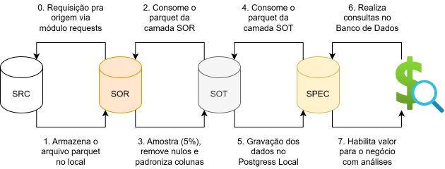

# 🏅 Arquitetura Medalhão

### 🎯 Objetivos do projeto
1. Construir a camada SOR: ingestão dos dados do sistema origem;
2. Construir a camada SOT: harmonizar os dados da camada SOR;
3. Construir a camada SPEC: especializar os dados da camada SOT;
4. Modelar usando o fato/dimensão: importar e modelar a SPEC no Postgres;
5. Gerar valor para o negócio: simular consultas utilizando as tabelas fato/dimensão.

### 🔍 Diagrama de alto nível do projeto

    

### ⚙️ Configurações necessárias para reprodução do projeto

<ol>
    <li style="font-weight: bold;">Realizar a preparação no windows 11</li>
        <ul>
            <li>Git Bash (2.53.0): acesse 'https://git-scm.com/downloads'; o download para windows será iniciado automaticamente; execute o instalador baixado; clique em 'next' em todas as etapas; finalize clicando em 'install'; valide a instalação: tecle 'windows'; busque por 'git bash' e abra o programa.</li>
            <li>PostgreSQL (18.3.0): adicione o diretório 'C:\Program Files\PostgreSQL\18\bin' nas variáveis de ambiente do seu usuário: tecle (windows + r); escreva 'sysdm.cpl'; clique na aba 'advanced'; clique em 'environment variables'; clique em 'path' (no primeiro retângulo); clique em uma linha branca; cole o texto 'C:\Program Files\PostgreSQL\18\bin'.</li>
            <li>Python (3.13.10): acesse o site 'https://www.python.org/ftp/python/3.13.10/python-3.13.10-amd64.exe' para download automático; clique em 'next' até a etapa 'choosing the default editor'; selecione o seu editor de texto; clique em 'next' até a etapa 'adjusting your PATH environment'; selecione a opção para registrar o Python nas variáveis de ambiente do sistema; siga até até a etapa 'install'; selecione a opção; reinicie o computador; tecle 'windows'; busque por 'terminal'; escreva 'python --version'; retorno esperado 'python 3.13.10'.</li>
            <li>Visual Studio Code (1.112.0): utilize o Git Bash como terminal padrão do VSCode: abra o programa; clique na engrenagem (canto inferior esquerdo); clique em 'settings'; escreva 'setting' na barra de pesquisa; clique em 'edit in setting.json' disponível no menu 'workbench > settings: apply to all profiles (applies to all profiles)'; adicione o comando '"terminal.integrated.defaultProfile.windows": "Git Bash"' no ao final do arquivo (lembre-se de incluir uma ',' na linha anterior).</li>
            <li>WSL (2.63.0): ativação e instalação do WSL: tecle 'windows'; busque por 'turn windows features on or off' e selecione; role a barra até o final e marque as opções 'virtual machine platform' e 'windows subsystem for linux'; reinicie o computador; agora podemos realizar a instalação do WSL; tecle 'windows'; busque por 'powershell'; clique com o botão direito e execute como administrador; escreva 'wsl --install' e tecle 'enter'; reinicie o computador; tecle 'windows'; busque por 'ubuntu'; crie um usuário e senha.</li>
        </ul>
    <li style="font-weight: bold;">Realizar a reprodução do pipeline localmente</li>
        <ul>
            <li>Clone o repositório do projeto em sua máquina.</li>
            <li>Realize a instalação de todas as dependências (requirements.txt).</li>
            <li>Execute os scripts em ordem: src/0-sor/script.ipynb, src/1-sot/script.ipynb e src/2-spec/script.ipynb.</li>
        </ul>
</ol>

### 🎲 Metadados da tabela utilizada como sistema origem do projeto

| Nome do campo           | Descrição do campo                                                                   | Tipo de dado do campo  |
|-------------------------|--------------------------------------------------------------------------------------|------------------------|
| hvfhs_license_num       | Número da licença TLC da empresa/base de alto volume (HVFHS)                         | STRING                 |
| dispatching_base_num    | Número da licença TLC da base que despachou a corrida                                | STRING                 |
| originating_base_num    | Número da base que recebeu originalmente a solicitação da corrida                    | STRING                 |
| request_datetime        | Data e hora em que o passageiro solicitou a corrida                                  | TIMESTAMP              |
| on_scene_datetime       | Data e hora em que o motorista chegou ao local de embarque                           | TIMESTAMP              |
| pickup_datetime         | Data e hora de início da viagem (embarque do passageiro)                             | TIMESTAMP              |
| dropoff_datetime        | Data e hora de término da viagem (desembarque do passageiro)                         | TIMESTAMP              |
| PULocationID            | Identificador da zona TLC onde a viagem começou                                      | INTEGER                |
| DOLocationID            | Identificador da zona TLC onde a viagem terminou                                     | INTEGER                |
| trip_miles              | Distância total da viagem em milhas                                                  | FLOAT                  |
| trip_time               | Tempo total da viagem em segundos                                                    | INTEGER                |
| base_passenger_fare     | Valor base da tarifa do passageiro antes de taxas, pedágios e gorjetas               | FLOAT                  |
| tolls                   | Valor total de pedágios pagos durante a viagem                                       | FLOAT                  |
| bcf                     | Valor total arrecadado para o fundo Black Car                                        | FLOAT                  |
| sales_tax               | Valor total de imposto sobre vendas (NYS sales tax)                                  | FLOAT                  |
| congestion_surcharge    | Valor total da taxa de congestionamento aplicada                                     | FLOAT                  |
| airport_fee             | Taxa fixa aplicada para embarque ou desembarque em aeroportos                        | FLOAT                  |
| tips                    | Valor total de gorjetas pagas ao motorista                                           | FLOAT                  |
| driver_pay              | Valor total pago ao motorista (exclui pedágios e gorjetas)                           | FLOAT                  |
| shared_request_flag     | Indicador se o passageiro solicitou corrida compartilhada (Y/N)                      | STRING                 |
| shared_match_flag       | Indicador se a corrida foi compartilhada com outro passageiro (Y/N)                  | STRING                 |
| access_a_ride_flag      | Indicador se a corrida foi realizada via programa MTA Access-A-Ride (Y/N)            | STRING                 |
| wav_request_flag        | Indicador se foi solicitado veículo acessível (WAV)                                  | STRING                 |
| wav_match_flag          | Indicador se a corrida ocorreu com veículo acessível (WAV)                           | STRING                 |
| cbd_congestion_fee      | Taxa de congestionamento da zona central (CBD), aplicada a partir de 2025            | FLOAT                  |